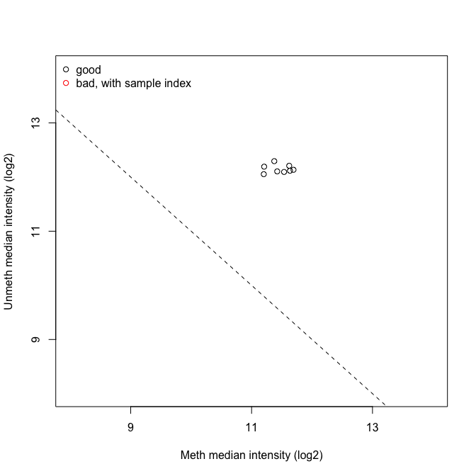
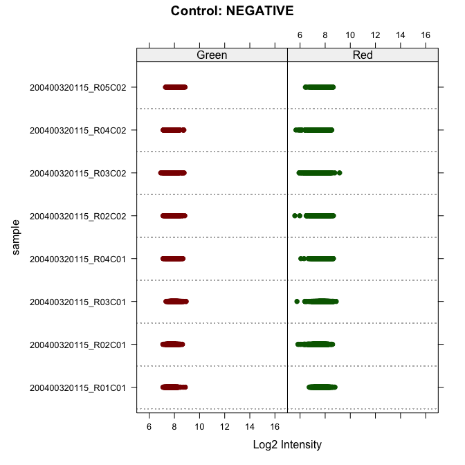
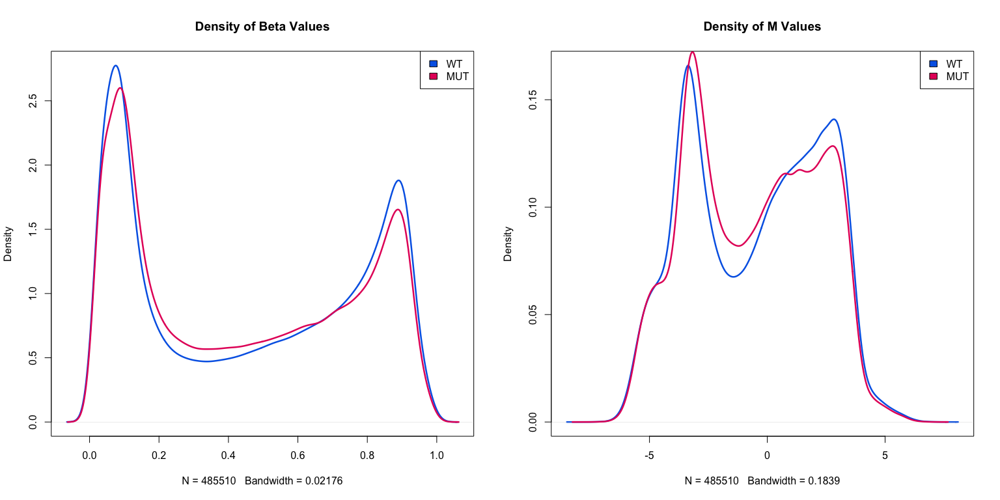
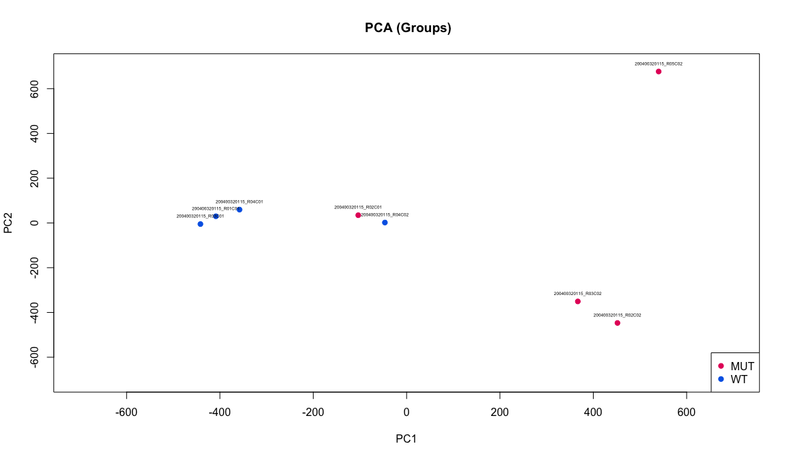
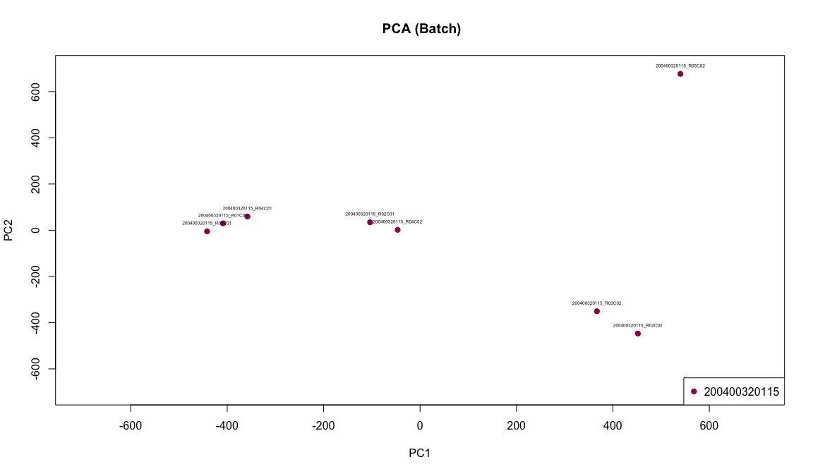
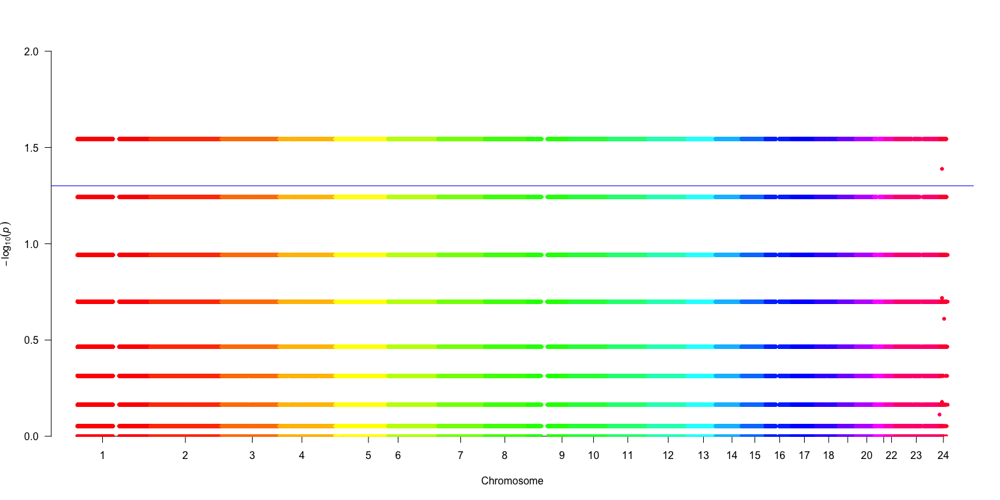
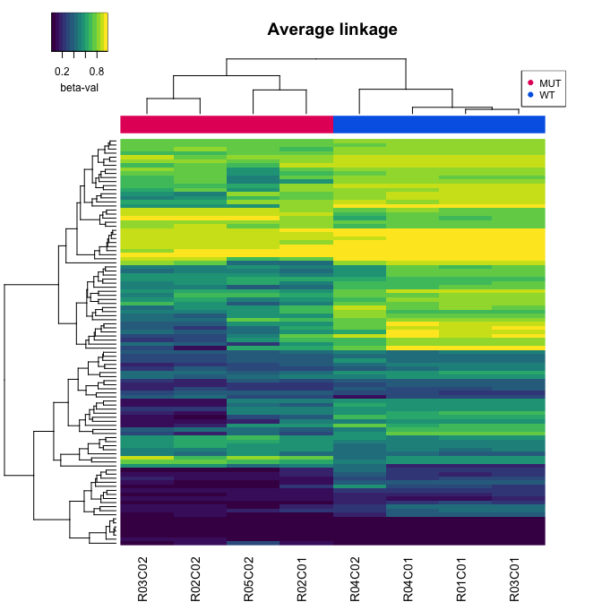

# DNA Methylation Analysis Pipeline for Infinium Data

This is the DNA/RNA Dynamics exam project (MSc Bioinformatics, University of Bologna), which aims to analyze DNA methylation data generated from the Illumina HumanMethylation450 Beadchip.
DNA methylation has been identified to be widely associated to complex diseases. Among biological platforms to profile DNA methylation in human, the Illumina Infinium HumanMethylation450 BeadChip (450K) has been accepted as one of the most efficient technologies. 

*DISCLAIMER*: *The choices in some passages (i.e. choice of the statistical test or of the significance threshold) were made for educational purposes only*


## Installation and Dependencies
This pipeline was runned in R (4.3.0 (2023-04-21 ucrt)).
You will need to have the following software and packages installed:

 ```r
# BiocManager
if (!require("BiocManager", quietly = TRUE))
    install.packages("BiocManager")
BiocManager::install(version = "3.10")

# minfi
BiocManager::install("minfi")

# Illumina manifest
BiocManager::install("IlluminaHumanMethylation450kmanifest")
BiocManager::install("IlluminaHumanMethylation450kanno.ilmn12.hg19")

# future.apply 
install.packages("future.apply")

# factoextra
install.packages("factoextra")

# qqman
install.packages("qqman")

# gplots
install.packages("gplots")

# viridis
install.packages("viridis")
```


### Infinium HumanMethylation450K Manifest file
In some steps it is needed to check the Manifest file, which can be found on the [Illumina website](http://support.illumina.com/array/array_kits/infinium_humanmethylation450_beadchip_kit/downloads.html)

The manifest was then cleaned, by removing the control and the rs probes in the followinf way

```r
Illumina450Manifest_clean <- Illumina450Manifest[!Illumina450Manifest$IlmnID %in% notMappedToCHR$IlmnID,]
```

## WORKFLOW
**Analytic pipeline of DNA methylation data in R code**
================
**Irene D’Onofrio**
28th June 2023

- <a href="#1-load-raw-data" id="toc-1-load-raw-data">1. Load raw data</a>
- <a href="#2-create-rg-dataframes" id="toc-2-create-rg-dataframes">2.
  Create R/G dataframes</a>
- <a href="#3-check-probe-info-by-address"
  id="toc-3-check-probe-info-by-address">3. Check probe info by
  address</a>
- <a href="#4-create-the-object-msetraw"
  id="toc-4-create-the-object-msetraw">4. Create the object MSet.raw</a>
- <a href="#5-quality-check" id="toc-5-quality-check">5. Quality check</a>
- <a href="#6-beta-and-m-values" id="toc-6-beta-and-m-values">6. Beta and
  M values</a>
- <a href="#7-functional-normalization"
  id="toc-7-functional-normalization">7. Functional normalization</a>
- <a href="#8-pca" id="toc-8-pca">8. PCA</a>
- <a href="#9-differential-methylation-analysis"
  id="toc-9-differential-methylation-analysis">9. Differential Methylation
  Analysis</a>
- <a href="#10-multiple-test-correction"
  id="toc-10-multiple-test-correction">10. Multiple test correction</a>
- <a href="#11-volcano-and-manhattan-plots"
  id="toc-11-volcano-and-manhattan-plots">11. Volcano and Manhattan
  plots</a>
- <a href="#12-heatmap" id="toc-12-heatmap">12. Heatmap</a>

------------------------------------------------------------------------

## 1. Load raw data

Loading of raw data with minfi and creation of an object called RGset
which stores the RGChannelSet object

``` r
rm(list=ls())
setwd('C:/Users/Irene/Desktop/LM Bioinformatics/DRD/Module2/Final Report-20230616/')
library(minfi)

baseDir <- ("C:/Users/Irene/Desktop/LM Bioinformatics/DRD/Module2/Final Report-20230616/Input/")
targets <- read.metharray.sheet(baseDir)
```

    ## [1] "C:/Users/Irene/Desktop/LM Bioinformatics/DRD/Module2/Final Report-20230616/Input/Samplesheet_report_2023.csv"

``` r
RGset <- read.metharray.exp(targets = targets) 
save(RGset,file="RGset.RData")
```

## 2. Create R/G dataframes

Creation of the Red and Green dataframes to store the red and green
fluorescences respectively

``` r
Red <- data.frame(getRed(RGset))
dim(Red)
```

    ## [1] 622399      8

``` r
head(Red)
```

    ##          X200400320115_R01C01 X200400320115_R02C01 X200400320115_R03C01
    ## 10600313                  591                  742                  613
    ## 10600322                 4140                 4154                 4553
    ## 10600328                 6535                 6250                 6223
    ## 10600336                15752                15110                16277
    ## 10600345                  597                 1027                  624
    ## 10600353                 1464                 1381                 1863
    ##          X200400320115_R04C01 X200400320115_R02C02 X200400320115_R03C02
    ## 10600313                  577                  592                  637
    ## 10600322                 3965                 3248                 3933
    ## 10600328                 6208                 6154                 6301
    ## 10600336                15746                13907                15217
    ## 10600345                  742                  529                  458
    ## 10600353                 1593                 1591                 1584
    ##          X200400320115_R04C02 X200400320115_R05C02
    ## 10600313                  812                  700
    ## 10600322                 5749                 7030
    ## 10600328                 6129                 5731
    ## 10600336                14955                15061
    ## 10600345                 1674                  393
    ## 10600353                 1649                 1237

``` r
Green <- data.frame(getGreen(RGset))
dim(Green)
```

    ## [1] 622399      8

``` r
head(Green)
```

    ##          X200400320115_R01C01 X200400320115_R02C01 X200400320115_R03C01
    ## 10600313                  289                  390                  408
    ## 10600322                 7070                 9820                 9225
    ## 10600328                 6421                 7184                 6963
    ## 10600336                 1571                 1467                 1526
    ## 10600345                 5692                 6353                 7518
    ## 10600353                 4280                 4824                 5346
    ##          X200400320115_R04C01 X200400320115_R02C02 X200400320115_R03C02
    ## 10600313                  360                  337                  431
    ## 10600322                 8324                 8910                 9553
    ## 10600328                 7171                 6836                 6522
    ## 10600336                 1864                 1620                 1496
    ## 10600345                 6360                 6418                 6805
    ## 10600353                 4373                 5110                 4774
    ##          X200400320115_R04C02 X200400320115_R05C02
    ## 10600313                  428                  379
    ## 10600322                 7285                 7154
    ## 10600328                 7554                 6933
    ## 10600336                 1602                 3729
    ## 10600345                 6566                 4261
    ## 10600353                 5290                 4087

## 3. Check probe info by address

Retrieving the Red and Green fluorescences and the chemistry of the
probes related to the following address: **64638362**. To check for the
type of probes it is necessary to look into the Manifest file, which has
been downloaded at the following from the from the Illumina website
(<http://support.illumina.com/array/array_kits/infinium_humanmethylation450_beadchip_kit/downloads.html>)
and then cleaned up (control and rs probes have been removed).

``` r
red_probe <- Red[rownames(Red) == "64638362", ]
green_probe <- Green[rownames(Green)=="64638362",]

load("C:/Users/Irene/Desktop/LM Bioinformatics/DRD/Module2/DRD_2023_Lesson_2-20230516/Illumina450Manifest_clean.RData")
Illumina450Manifest_clean[Illumina450Manifest_clean$AddressA_ID=="64638362", 'Infinium_Design_Type']
```

    ## [1] II
    ## Levels: I II

``` r
df_address <- data.frame(Sample=colnames(green_probe), Red_fluor=unlist(red_probe, use.names = FALSE ), Green_fluor=unlist(green_probe, use.names = FALSE ), Type = "II")
df_address
```

    ##                 Sample Red_fluor Green_fluor Type
    ## 1 X200400320115_R01C01      4523        6186   II
    ## 2 X200400320115_R02C01      5608        6704   II
    ## 3 X200400320115_R03C01      4885        6836   II
    ## 4 X200400320115_R04C01      4247        7352   II
    ## 5 X200400320115_R02C02       311         445   II
    ## 6 X200400320115_R03C02       254         299   II
    ## 7 X200400320115_R04C02      1343        5045   II
    ## 8 X200400320115_R05C02       433         249   II

It is possible to see that the address corresponds to a Type II probe
thus no color channel is specified. Moreover, this kind of probes has a
correspondence only for the address A and not for the address B.

## 4. Create the object MSet.raw

``` r
MSet.raw <- preprocessRaw(RGset)
MSet.raw
```

    ## class: MethylSet 
    ## dim: 485512 8 
    ## metadata(0):
    ## assays(2): Meth Unmeth
    ## rownames(485512): cg00050873 cg00212031 ... ch.22.47579720R
    ##   ch.22.48274842R
    ## rowData names(0):
    ## colnames(8): 200400320115_R01C01 200400320115_R02C01 ...
    ##   200400320115_R04C02 200400320115_R05C02
    ## colData names(8): Sample Group ... Basename filenames
    ## Annotation
    ##   array: IlluminaHumanMethylation450k
    ##   annotation: ilmn12.hg19
    ## Preprocessing
    ##   Method: Raw (no normalization or bg correction)
    ##   minfi version: 1.46.0
    ##   Manifest version: 0.4.0

## 5. Quality check

Quality checks:

1)  QCplot

2)  check of the intensity of negative controls using minfi

3)  calculation of the detection pValues; for each sample, how many
    probes have a detection p-value higher than the threshold **0.05**?

#### 5.1 QCplot

In a QCplot, the medians from the methylation signal and unmethylation
signal distributions are plotted. Data of **good quality** are found at
**high values of median for both the distributions** (that is right and
upper part); on the contrary, low values of median indicate a lower
quality of data.

The QC plot has two main limits:

- It doesn’t take into account the background signal

- It doesn’t take into account whether some failure happens during the
  sample preparation

The getQC() function creates a DataFrame with two columns: mMed and uMed
which are the chipwide medians of the Meth and Unmeth channels. Through
plotQC(), a diagnostic QC plot is produced from this dataframe.

``` r
qc <- getQC(MSet.raw)
plotQC(qc)
```



Here, it is clearly visible that **all the samples** cluster together
with a good median value, indicating their **good quality**.

#### 5.2 Negative control intensity check

The negative controls probes are used to estimate the **background
intensity** of the system. Under normal experimental condition, the
intensity values for these probes can vary from 100 up to 1000 units in
a sample-dependent way. An increase of a given sample may indicate poor
quality of the DNA template prior to bisulphite conversion.

The check is performed through the function controlStripPlot(), that
produces strip plots for the specified control probe type (only
negative, in this analysis).

``` r
controlStripPlot(RGset, controls="NEGATIVE")
```



Here, in both channel the intensity values are below 10, thus they are
in the acceptable range.

#### 5.3 Failed position check

The p-value can help to decide if you need to remove a specific sample,
since it indicates the chance that the target sequence signal is
distinguishable from the negative controls.

Usually, **bad sample** contains **more than 5%** of bad probes.

``` r
detP <- detectionP(RGset)
failed <- detP>0.05


num_failed = colSums(failed)


df_failed <- data.frame(Sample=colnames(green_probe), Failed_Position=num_failed, perc_failed_probes=(means_of_columns <- colMeans(failed))*100, row.names = NULL)

df_failed
```

    ##                 Sample Failed_Position perc_failed_probes
    ## 1 X200400320115_R01C01              45        0.009268566
    ## 2 X200400320115_R02C01              26        0.005355171
    ## 3 X200400320115_R03C01              28        0.005767108
    ## 4 X200400320115_R04C01              32        0.006590980
    ## 5 X200400320115_R02C02             190        0.039133945
    ## 6 X200400320115_R03C02             130        0.026775857
    ## 7 X200400320115_R04C02              17        0.003501458
    ## 8 X200400320115_R05C02             406        0.083623062

None of the samples has a percentage of failed probes higher than 5%,
thus we can retain them.

## 6. Beta and M values

Calculation of raw beta and M values and plotting of the densities of
mean methylation values, dividing the samples in WT and MUT.

Beta and M values are two metrics to measure methylation levels. The
M-value is more statistically valid for the differential analysis of
methylation levels. However, the β-value is much more biologically
interpretable.

``` r
wt <- targets[targets$Group=="WT", "Basename"]
mut <- targets[targets$Group=="MUT", "Basename"]
wt <- gsub(baseDir, "", wt)
mut <- gsub(baseDir, "", mut)

wtSet <- MSet.raw[,colnames(MSet.raw) %in% wt]
mutSet <- MSet.raw[,colnames(MSet.raw) %in% mut]

wtBeta <- getBeta(wtSet)
wtM <- getM(wtSet)
mutBeta <- getBeta(mutSet)
mutM <- getM(mutSet)

mean_wtBeta <- apply(wtBeta,MARGIN=1,mean,na.rm=T)
mean_mutBeta <- apply(mutBeta,MARGIN=1,mean,na.rm=T)
mean_wtM <- apply(wtM,MARGIN=1,mean,na.rm=T)
mean_mutM <- apply(mutM,MARGIN=1,mean,na.rm=T)


d_mean_wtBeta <- density(mean_wtBeta,na.rm=T)
d_mean_mutBeta <- density(mean_mutBeta,na.rm=T)
d_mean_wtM <- density(mean_wtM,na.rm=T)
d_mean_mutM <- density(mean_mutM,na.rm=T)
```

``` r
par(mfrow=c(1,2))
plot(d_mean_wtBeta,main="Density of Beta Values",col="#0067E6", lwd=2.5)
lines(d_mean_mutBeta,main="Density of Beta Values",col="#E50068", lwd=2.5)

legend('topright', legend=c("WT", "MUT"), 
       fill = c("#0067E6","#E50068"), cex=1
)
plot(d_mean_wtM,main="Density of M Values",col="#0067E6", lwd=2.5)
lines(d_mean_mutM,main="Density of M Values",col="#E50068", lwd=2.5)
legend('topright', legend=c("WT", "MUT"), 
       fill = c("#0067E6","#E50068"), cex=1
)
```



Overall, by looking at the two graphs seems that WT and MUT have a
similar distribution for both the beta value and the M value. However,
there are some differences: - *central values*: WT are slightly lower -
*peaks values*: WT are slightly higher

## 7. Functional normalization

Normalizion of the data using the **Functional Normalization** and
comparison between raw data and normalized data.

Functional normalization extends the idea of quantile normalization by
**adjusting for known covariates measuring unwanted variation**. For the
450k array, the first k principal components of the internal control
probes matrix play the role of the covariates adjusting for technical
variation. By choosing covariates that only measure unwanted technical
variation, functional normalization will only remove the variation
explained by these technical measurements and will **leave biological
variation intact**. Functional normalization allows a sensible trade-off
between not removing any technical variation at all (no normalization)
and removing too much variation, including global biological variation,
as can occur in quantile normalization.

The output is a plot with 6 panels in which, for both raw and normalized
data, there are: density plots of beta mean values according to the
chemistry of the probes; density plot of beta standard deviation values
according to the chemistry of the probes; boxplot of beta values.

``` r
#creation of two dataframes, containing only type I (dfI) or type II (dfII) probes
dfI <- Illumina450Manifest_clean[Illumina450Manifest_clean$Infinium_Design_Type=="I",]
dfI <- droplevels(dfI)
dfII <- Illumina450Manifest_clean[Illumina450Manifest_clean$Infinium_Design_Type=="II",]
dfII <- droplevels(dfII)

#subsetting of the beta matrix according to the chemistry of the probes
beta <- getBeta(MSet.raw)
beta_I <- beta[rownames(beta) %in% dfI$IlmnID,]
beta_II <- beta[rownames(beta) %in% dfII$IlmnID,]

#calculation of the mean, sd and their corresponding density for the raw data
mean_of_beta_I <- apply(beta_I,1,mean,na.rm=T)
mean_of_beta_II <- apply(beta_II,1,mean,na.rm=T)
d_mean_of_beta_I <- density(mean_of_beta_I,na.rm=T)
d_mean_of_beta_II <- density(mean_of_beta_II,na.rm=T)

sd_of_beta_I <- apply(beta_I,1,sd,na.rm=T)
sd_of_beta_II <- apply(beta_II,1,sd,na.rm=T)
d_sd_of_beta_I <- density(sd_of_beta_I,na.rm=T)
d_sd_of_beta_II <- density(sd_of_beta_II,na.rm=T)

#application of the Functional Normalization
preprocessFunnorm_results <- preprocessFunnorm(RGset)
beta_Funnorm <- getBeta(preprocessFunnorm_results)
beta_Funnorm_I <- beta_Funnorm[rownames(beta_Funnorm) %in% dfI$IlmnID,]
beta_Funnorm_II <- beta_Funnorm[rownames(beta_Funnorm) %in% dfII$IlmnID,]


#calculation of the mean, sd and their corresponding density for the normalized data
mean_of_beta_Funnorm_I <- apply(beta_Funnorm_I,1,mean,na.rm=T)
mean_of_beta_Funnorm_II <- apply(beta_Funnorm_II,1,mean,na.rm=T)
d_mean_of_beta_Funnorm_I <- density(mean_of_beta_Funnorm_I,na.rm=T)
d_mean_of_beta_Funnorm_II <- density(mean_of_beta_Funnorm_II,na.rm=T)

sd_of_beta_Funnorm_I <- apply(beta_Funnorm_I,1,sd,na.rm=T)
sd_of_beta_Funnorm_II <- apply(beta_Funnorm_II,1,sd,na.rm=T)
d_sd_of_beta_Funnorm_I <- density(sd_of_beta_Funnorm_I,na.rm=T)
d_sd_of_beta_Funnorm_II <- density(sd_of_beta_Funnorm_II,na.rm=T)
```

``` r
par(mfrow=c(2,3))
targets$Group <- as.factor(targets$Group)
palette(c("#E50068", "#0067E6"))

#Raw data graphs
plot(d_mean_of_beta_I,col="#77FF00",main="raw Beta density", lwd=2.5)
lines(d_mean_of_beta_II,col="#FF7038",lwd=2.5)
legend('topright', legend=c("Type I","Type II"), fill = c("#77FF00","#FF7038"), cex=1)
plot(d_sd_of_beta_I,col="#77FF00",main="raw sd density", lwd=2.5)
lines(d_sd_of_beta_II,col="#FF7038",lwd=2.5)
legend('topright', legend=c("Type I","Type II"), fill = c("#77FF00","#FF7038"), cex=1)
boxplot(beta, col = targets$Group)
title('Boxplot of raw Beta values')


#Normalized data graphs
plot(d_mean_of_beta_Funnorm_I,col="#77FF00",main="preprocessFunnorm Beta density",lwd=2.5)
lines(d_mean_of_beta_Funnorm_II,col="#FF7038",lwd=2.5)
legend('topright', legend=c("Type I","Type II"), fill = c("#77FF00","#FF7038"), cex=1)
plot(d_sd_of_beta_Funnorm_I,col="#77FF00",main="preprocessFunnorm sd density",lwd=2.5)
lines(d_sd_of_beta_Funnorm_II,col="#FF7038",lwd=2.5)
legend('topright', legend=c("Type I","Type II"), fill = c("#77FF00","#FF7038"), cex=1)
boxplot(beta_Funnorm, col = targets$Group)
title('Boxplot of normalized Beta values')
```


The Functional Normalization produced some differences: the mean density
of the raw data showed more difference between the two types of probes,
while after the normalization they appear more overlapping. Looking at
the boxplot, for the raw data the variation is more visible than for the
normalized one. Also, the median and Q1 have been shifted to lower
values.

## 8. PCA

Performing PCA on the matrix of normalized beta values generated in step
7, after normalization Checking how samples cluster by group, sex or
batch.

``` r
pca_results <- prcomp(t(beta_Funnorm),scale=T)
par(mfrow=c(1,1))


library(factoextra)
fviz_eig(pca_results, addlabels = T,xlab='PC number',ylab='% of variance', barfill = "#0063A6", barcolor = "black")
```


As we can see from the Scree Plot, the **first two PCs** explain the
**55.5%** of the variance.

``` r
targets$Group <- as.factor(targets$Group)
palette(c("#E50068", "#0067E6"))
plot(pca_results$x[,1], pca_results$x[,2],cex=1,pch=19,col=targets$Group,xlab="PC1",ylab="PC2",xlim=c(-700,700),ylim=c(-700,700), main=' PCA (Groups)')
text(pca_results$x[,1], pca_results$x[,2],labels=rownames(pca_results$x),cex=0.4,pos=3)
legend("bottomright",legend=levels(targets$Group),col=c(1,2),pch=19, cex=1.0)
```



The groups are divided mainly by the PC1, indeed all the WTs are at
lower values of PC1 with respect to the MUTs which are mainly located in
the right part of the graph, where the PC1 values are higher. However,
while the WTs are well clustered according also to PC2, the same is not
for the MUTs which are located at different values of PC2, except for
R02C02 and R03C02 which cluster very well. Interesting to notice that
R02C01, although being a MUT, clusters with the WTs.

``` r
targets$Sex <- as.factor(targets$Sex)
palette(c("#C364CA", "#8BC4F9"))
plot(pca_results$x[,1], pca_results$x[,2],cex=1,pch=19,col=targets$Sex,xlab="PC1",ylab="PC2",xlim=c(-700,700),ylim=c(-700,700), main='PCA (Sex)')
text(pca_results$x[,1], pca_results$x[,2],labels=rownames(pca_results$x),cex=0.4,pos=3)
legend("bottomright",legend=levels(targets$Sex),col=c(1:nlevels(targets$Group)),pch=19,cex=1.0)
```


By looking at the graph, we can clearly see a division with respect to
the sex according to PC1. Moreover, males cluster well together also
according to PC2, the same is not for the females. Females are divided
into three clusters, which can be found at different levels of PC2. One
of the females cluster is really close to the males cluster, especially
according to PC2.

``` r
targets$Slide <- as.factor(targets$Slide)
palette(c("#9e0059", "green"))
plot(pca_results$x[,1], pca_results$x[,2],cex=1,pch=19,col=targets$Slide,xlab="PC1",ylab="PC2",xlim=c(-700,700),ylim=c(-700,700), main=' PCA (Batch)')
text(pca_results$x[,1], pca_results$x[,2],labels=rownames(pca_results$x),cex=0.4,pos=3)
legend("bottomright",legend=levels(targets$Slide),col=c(1,2),pch=19, cex=1.0)
```



Since all the samples belong to the same batch (**200400320115**) we
cannot see a difference in terms of clustering.

## 9. Differential Methylation Analysis

Identification of differentially methylated probes between group WT and
group MUT through the application of the Mann Whitney test.

``` r
library(future.apply) #for parallelization
plan(multisession)
My_MannWhitney_function <- function(x) {
  wilcox <- wilcox.test(x~ targets$Group)
  return(wilcox$p.value)
} 
pValues_wilcox <- future_apply(beta_Funnorm,1, My_MannWhitney_function)

final_wilcox<- data.frame(beta_Funnorm, pValues_wilcox)

final_wilcox <- final_wilcox[order(final_wilcox$pValues_wilcox),]

table(final_wilcox$pValues_wilcox)
```

    ## 
    ## 0.0285714285714286 0.0408331258612995 0.0571428571428571  0.114285714285714 
    ##              57260                  1              40381              49164 
    ##  0.191266986878869                0.2  0.245383458473363  0.342857142857143 
    ##                  1              56188                  1              78593 
    ##  0.485714285714286  0.663117245320382  0.685714285714286  0.771503409140308 
    ##              50509                  1              61548                  1 
    ##  0.885714285714286                  1 
    ##              56940              34924

As we can see from the table, the **distribution** of the nominal
P-values is **discrete** since we applied a non-parametric test.

## 10. Multiple test correction

Application of multiple test correction, setting a significant threshold
of **0.05**.

``` r
#multiple testing correction
corrected_pValues_BH <- p.adjust(final_wilcox$pValues_wilcox,"BH")
corrected_pValues_Bonf <- p.adjust(final_wilcox$pValues_wilcox,"bonferroni")

#creation of a dataframe that contains the nominal p-values and the p-values after both corrections.
final_wilcox_corrected <- data.frame(final_wilcox, corrected_pValues_BH, corrected_pValues_Bonf)

#differentially methylated probes according to the threshold (both before and after the corrections)
before_correction <- nrow(final_wilcox_corrected[final_wilcox_corrected$pValues_wilcox<= 0.05,])
after_Bonferroni <- nrow(final_wilcox_corrected[final_wilcox_corrected$corrected_pValues_Bonf <= 0.05,])
after_BH <- nrow(final_wilcox_corrected[final_wilcox_corrected$corrected_pValues_BH <= 0.05,])


diff_meth_df <- data.frame(before_correction, after_Bonferroni, after_BH)
rownames(diff_meth_df) <- c("# differentially methylated probes")
diff_meth_df
```

    ##                                    before_correction after_Bonferroni after_BH
    ## # differentially methylated probes             57261                0        0

As we can see, both multiple test corrections led to **non significant
results**.

``` r
par(mfrow=c(1,1))
boxplot(final_wilcox_corrected [,9:11], col = c("#7038FF", "#C7FF38", "seashell2"), names=NA)
legend("bottomright", legend=c("raw", "BH", "Bonferroni"),col=c("#7038FF", "#C7FF38", "seashell2"), lty=1:1, cex=0.8, xpd=TRUE, pch=15)
```


## 11. Volcano and Manhattan plots

Production of a Volcano plot and a Manhattan plot of the results of
differential methylation analysis

``` r
# WT group mean
WT_group <- final_wilcox_corrected[,targets$Group=="WT"]
WT_group_mean <- apply(WT_group, 1, mean)

# MUT group mean
MUT_group <- final_wilcox_corrected[,targets$Group=="MUT"]
MUT_group_mean <- apply(MUT_group, 1, mean)

# Compute delta
delta <- WT_group_mean - MUT_group_mean

#create a dataframe
toVolcPlot <- data.frame(delta, -log10(final_wilcox_corrected$pValues_wilcox))
head(toVolcPlot)
```

    ##                 delta X.log10.final_wilcox_corrected.pValues_wilcox.
    ## cg13869341 0.06955720                                       1.544068
    ## cg24335620 0.05708216                                       1.544068
    ## cg08858441 0.02466250                                       1.544068
    ## cg03213877 0.12383643                                       1.544068
    ## cg16736630 0.05756981                                       1.544068
    ## cg05597748 0.25624833                                       1.544068

``` r
par(mfrow=c(1,1))
HighLight <- toVolcPlot[abs(toVolcPlot[,1])>0.1 & toVolcPlot[,2]>(-log10(0.05)),]
plot(toVolcPlot[,1],toVolcPlot[,2], pch=19, cex=0.6 ,xlab="delta",ylab="-log10(Pvalue)", col="black")
abline(a=-log10(0.05),b=0, col="#fb8b24")
points(HighLight[,1], HighLight[,2], pch=17, cex=0.6, col="#00f5d4")
```


``` r
library(qqman)
final_wilcox_corrected_df <- data.frame(rownames(final_wilcox_corrected),final_wilcox_corrected)
colnames(final_wilcox_corrected_df)[1] <- "IlmnID"

final_wilcox_corrected_annotated <- merge(final_wilcox_corrected_df, Illumina450Manifest_clean,by="IlmnID")

input_Manhattan <- data.frame(ID=final_wilcox_corrected_annotated$IlmnID,CHR=final_wilcox_corrected_annotated$CHR, MAPINFO=final_wilcox_corrected_annotated$MAPINFO, PVAL=final_wilcox_corrected_annotated$pValues_wilcox)
head(input_Manhattan)
```

    ##           ID CHR   MAPINFO       PVAL
    ## 1 cg00000029  16  53468112 0.02857143
    ## 2 cg00000108   3  37459206 0.11428571
    ## 3 cg00000109   3 171916037 0.11428571
    ## 4 cg00000165   1  91194674 0.02857143
    ## 5 cg00000236   8  42263294 0.88571429
    ## 6 cg00000289  14  69341139 0.68571429

``` r
levels(input_Manhattan$CHR)[levels(input_Manhattan$CHR) == "X"] <- "23"               
levels(input_Manhattan$CHR)[levels(input_Manhattan$CHR) == "Y"] <- "24"              
input_Manhattan$CHR <- as.numeric(as.character(input_Manhattan$CHR))
```

``` r
manhattan(input_Manhattan, snp="ID",chr="CHR", bp="MAPINFO", p="PVAL",annotatePval = FALSE,col=rainbow(24), annotateTop = F)
```



*In both the Volcano and the Manhattan plot the data are “stratified”,
because of the application of a non-parametric test.*

## 12. Heatmap

Production of an heatmap of the top 100 differentially methylated probes

``` r
library(gplots)
library(viridis)
input_heatmap=as.matrix(final_wilcox[1:100,1:8])
```

#### Linkage method: complete

``` r
group_color = c()
i = 1
for (name in colnames(beta)){
  if (name %in% wt){group_color[i]="#0067E6"}
  else{group_color[i]="#E50068"}
  i = i+1
}

heatmap.2(input_heatmap,col=viridis(100),Rowv=T,Colv=T,dendrogram="both",key=T,ColSideColors=group_color,density.info="none",trace="none",scale="none",symm=F,main="Complete linkage",key.xlab='beta-val',key.title=NA,keysize=1,labRow=NA)
legend("topright", legend=levels(targets$Group),col=c('#E50068','#0067E6'),pch = 19,cex=0.7)
```


#### Linkage method: single

``` r
heatmap.2(input_heatmap,col=viridis(100),Rowv=T,Colv=T,hclustfun = function(x) hclust(x,method = 'single'),dendrogram="both",key=T,ColSideColors=group_color,density.info="none",trace="none",scale="none",symm=F,main="Single linkage",key.xlab='beta-val',key.title=NA,keysize=1,labRow=NA)
legend("topright", legend=levels(targets$Group),col=c('#E50068','#0067E6'),pch = 19,cex=0.7)
```


#### Linkage method: average

``` r
heatmap.2(input_heatmap,col=viridis,Rowv=T,Colv=T,hclustfun = function(x) hclust(x,method = 'average'),dendrogram="both",key=T,ColSideColors=group_color
          ,density.info="none",trace="none",scale="none",symm=F,main="Average linkage",key.xlab='beta-val',key.title=NA,keysize=1,labRow=NA)
legend("topright", legend=levels(targets$Group),col=c('#E50068','#0067E6'),pch = 19,cex=0.7)
```


